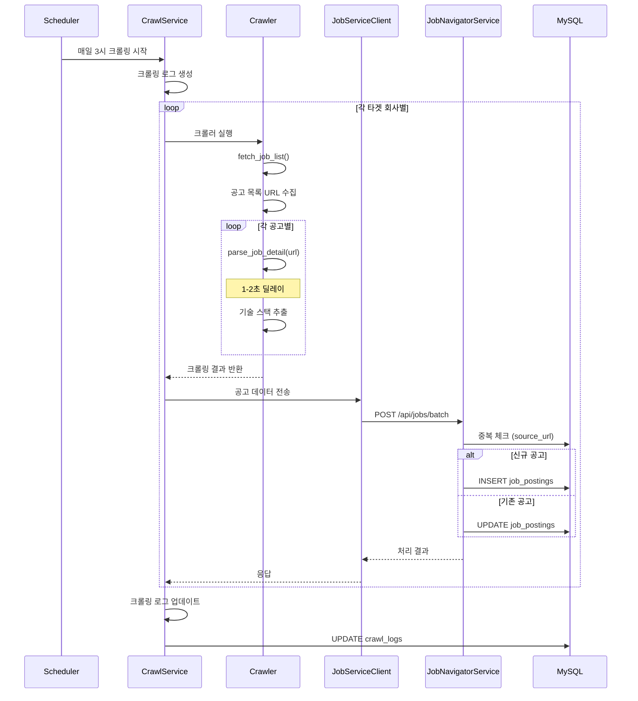
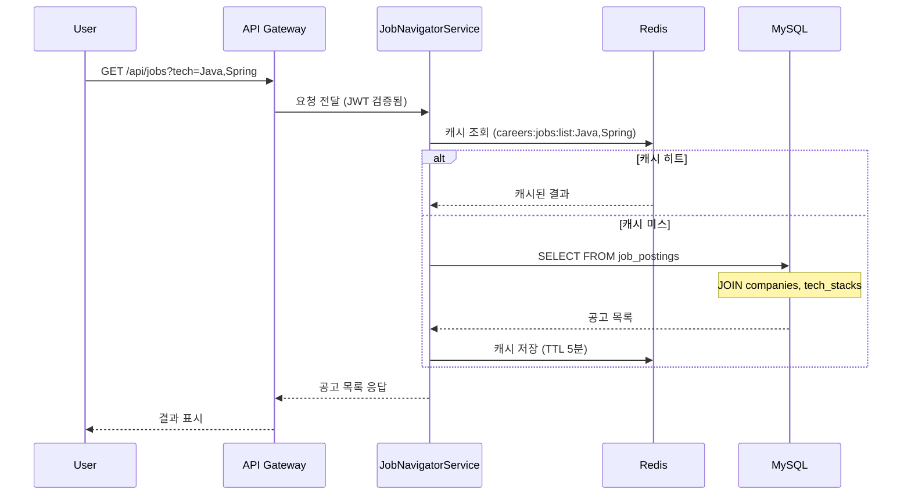
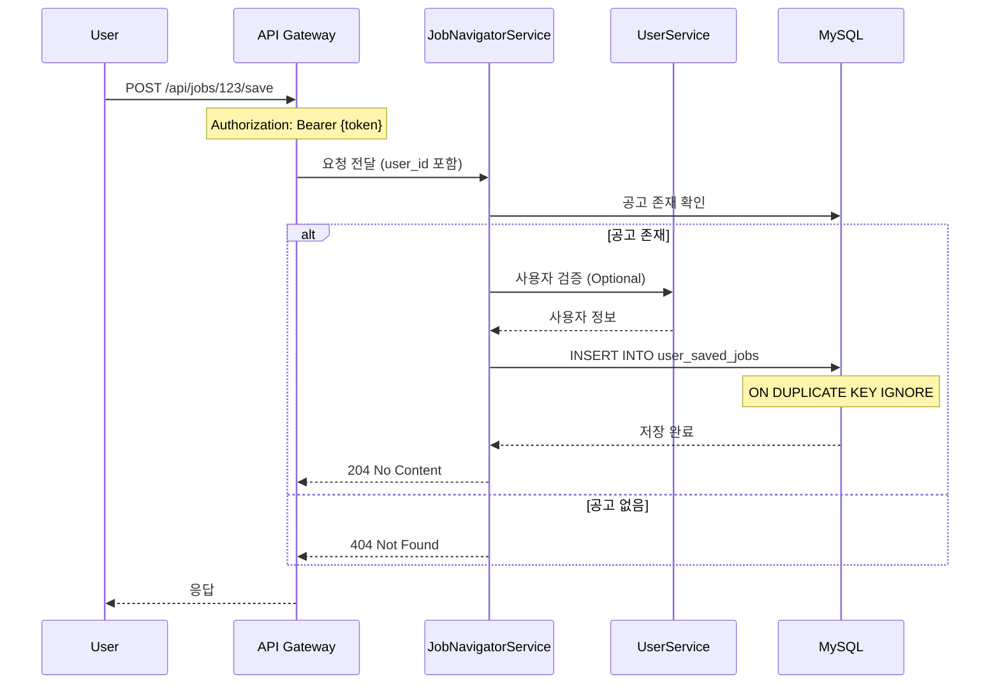
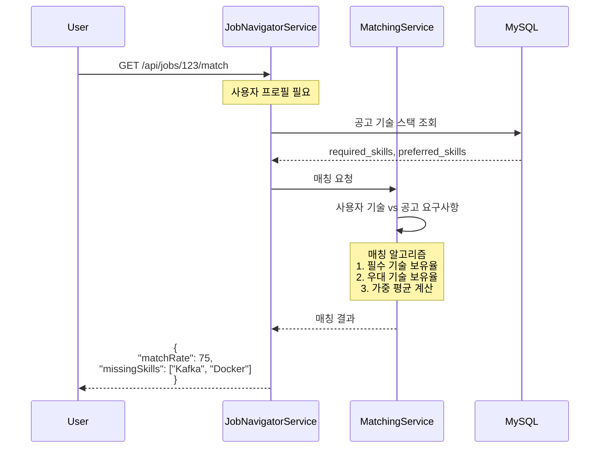
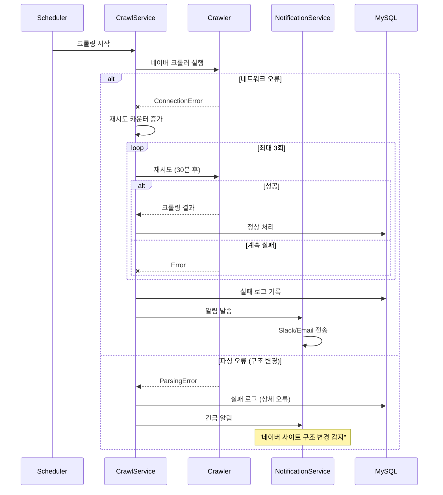

# Job Navigator 백엔드 설계 문서 v1.2 (구현 완료)

## 1. 개요

### 1.1 서비스명
**Job Navigator** - AsyncSite의 개발자 채용 공고 수집 및 매칭 서비스

> 업데이트: 2025-08-01 - v1 구현 완료, TechStack 관계 매핑 및 Gateway 통합 완료

### 1.2 설계 원칙
- **단순성 우선**: v1은 MVP로 핵심 기능에만 집중
- **안정성 중시**: 크롤링 실패에 대한 견고한 처리
- **확장 가능성**: 향후 기능 추가를 고려한 구조 설계
- **AsyncSite 표준 준수**: 기존 마이크로서비스 아키텍처 및 코딩 규칙 준수

### 1.3 v1 범위 (구현 상태)
- ✅ ~~타겟 기업(네카라쿠배) 채용 공고 크롤링~~ → 수동 데이터 입력으로 대체
- ✅ 공고 데이터 저장 및 관리 (완료)
- ✅ 기본 검색/필터링 API (완료)
- ✅ 간단한 기술 스택 매칭 (완료)
- ✅ Redis 캐싱 (완료)
- ✅ Gateway 통합 (완료)
- ⚠️ TechStack 필터링 (버그 있음)
- ❌ AI/ML 기반 분석 (v2)
- ❌ 복잡한 추천 시스템 (v2)
- ❌ 커뮤니티 기능 (v2)

## 2. 시스템 아키텍처

### 2.1 마이크로서비스 구성

```
┌─────────────────────────────────────────────────────────────┐
│                        API Gateway                           │
│                    (asyncsite-gateway)                       │
└───────────────┬─────────────────────┬──────────────────────┘
                │                     │
                │ /api/jobs/**        │ /api/auth/**
                ▼                     ▼
┌───────────────────────────┐ ┌────────────────────┐
│  Job Navigator Service    │ │   User Service     │
│  (job-navigator-service)  │ │   (기존)           │
│                           │ │                    │
│  - 공고 CRUD              │ │   - 인증/인가      │
│  - 검색/필터링            │ │   - 사용자 프로필  │
│  - 기술 매칭              │ │                    │
└───────────┬───────────────┘ └────────────────────┘
            │
            ▼
┌───────────────────────────┐
│  Job Crawler Service      │
│  (job-crawler-service)    │
│                           │
│  - 스케줄링               │
│  - 크롤링 실행            │
│  - 데이터 파싱            │
└───────────────────────────┘
            │
            ▼
┌───────────────────────────────────────────────────┐
│              Shared Infrastructure                 │
│  - MySQL (asyncsite-mysql)                        │
│  - Redis (asyncsite-redis)                        │
│  - Eureka (asyncsite-eureka)                      │
└───────────────────────────────────────────────────┘
```

### 2.2 서비스별 책임

#### Job Navigator Service (메인 비즈니스 로직)
- 채용 공고 CRUD 작업
- 검색 및 필터링 기능
- 기술 스택 매칭 로직
- 사용자별 관심 공고 관리
- REST API 제공

#### Job Crawler Service (크롤링 전담)
- 스케줄 기반 크롤링 실행
- 타겟 사이트별 크롤러 관리
- HTML 파싱 및 데이터 추출
- 크롤링 상태 모니터링
- Job Navigator Service로 데이터 전송

## 3. 기술 스택

### 3.1 Job Navigator Service (game-service와 동일)
- **Language**: Java 21
- **Framework**: Spring Boot 3.5.3
- **Build**: Gradle
- **Database**: MySQL 8.0
- **Cache**: Redis
- **API Docs**: SpringDoc OpenAPI 2.8.0 (Swagger)
- **Security**: Spring Security + JWT
- **Service Discovery**: Spring Cloud Netflix Eureka
- **Testing**: JUnit 5, RestAssured, Testcontainers

### 3.2 Job Crawler Service
- **Language**: Python 3.11+
- **Framework**: FastAPI
- **Crawler**: BeautifulSoup4 + httpx (async)
- **Scheduler**: APScheduler
- **Task Queue**: Redis Queue
- **Settings**: Pydantic Settings
- **Logging**: structlog
- **Testing**: pytest + pytest-asyncio

## 4. Clean Architecture 적용

### 4.1 Job Navigator Service 패키지 구조 (Java)

```
com.asyncsite.jobnavigator/
├── adapter/
│   ├── in/
│   │   └── web/
│   │       ├── JobWebAdapter.java
│   │       ├── SearchWebAdapter.java
│   │       └── UserJobWebAdapter.java
│   └── out/
│       ├── persistence/
│       │   ├── JobPersistenceAdapter.java
│       │   ├── entity/
│       │   │   ├── JobJpaEntity.java
│       │   │   └── CompanyJpaEntity.java
│       │   ├── mapper/
│       │   │   └── JobMapper.java
│       │   └── repository/
│       │       └── JobRepository.java
│       └── client/
│           └── CrawlerServiceClient.java
├── application/
│   ├── port/
│   │   ├── in/
│   │   │   ├── CreateJobUseCase.java
│   │   │   ├── SearchJobUseCase.java
│   │   │   └── MatchJobUseCase.java
│   │   └── out/
│   │       ├── LoadJobPort.java
│   │       ├── SaveJobPort.java
│   │       └── NotifyCrawlerPort.java
│   ├── service/
│   │   ├── JobService.java
│   │   ├── SearchService.java
│   │   └── MatchingService.java
│   └── dto/
│       ├── JobResponse.java
│       └── SearchRequest.java
└── domain/
    ├── Job.java
    ├── Company.java
    ├── TechStack.java
    └── JobMatcher.java
```

### 4.2 Job Crawler Service 패키지 구조 (Python)

```
job_crawler_service/
├── src/
│   ├── adapter/
│   │   ├── inbound/
│   │   │   ├── api/
│   │   │   │   ├── __init__.py
│   │   │   │   ├── crawler_controller.py
│   │   │   │   └── health_controller.py
│   │   │   └── scheduler/
│   │   │       └── crawl_scheduler.py
│   │   └── outbound/
│   │       ├── crawler/
│   │       │   ├── __init__.py
│   │       │   ├── base_crawler.py
│   │       │   ├── naver_crawler.py
│   │       │   ├── kakao_crawler.py
│   │       │   └── parsers/
│   │       │       └── job_parser.py
│   │       └── client/
│   │           └── job_service_client.py
│   ├── application/
│   │   ├── port/
│   │   │   ├── inbound/
│   │   │   │   ├── __init__.py
│   │   │   │   └── crawl_use_case.py
│   │   │   └── outbound/
│   │   │       ├── __init__.py
│   │   │       ├── crawl_job_port.py
│   │   │       └── send_job_port.py
│   │   ├── service/
│   │   │   ├── __init__.py
│   │   │   └── crawl_service.py
│   │   └── dto/
│   │       ├── __init__.py
│   │       └── job_dto.py
│   ├── domain/
│   │   ├── __init__.py
│   │   ├── job.py
│   │   └── crawl_result.py
│   └── infrastructure/
│       ├── config/
│       │   ├── __init__.py
│       │   └── settings.py
│       ├── logging/
│       │   └── logger.py
│       └── monitoring/
│           └── metrics.py
├── tests/
├── requirements.txt
└── Dockerfile
```

## 5. 데이터베이스 설계

### 5.1 주요 테이블

```sql
-- 회사 정보
CREATE TABLE companies (
    id BIGINT AUTO_INCREMENT PRIMARY KEY,
    name VARCHAR(100) NOT NULL UNIQUE,
    name_en VARCHAR(100),
    career_page_url VARCHAR(500),
    logo_url VARCHAR(500),
    created_at TIMESTAMP DEFAULT CURRENT_TIMESTAMP,
    updated_at TIMESTAMP DEFAULT CURRENT_TIMESTAMP ON UPDATE CURRENT_TIMESTAMP,
    INDEX idx_name (name)
) ENGINE=InnoDB DEFAULT CHARSET=utf8mb4;

-- 채용 공고
CREATE TABLE job_postings (
    id BIGINT AUTO_INCREMENT PRIMARY KEY,
    company_id BIGINT NOT NULL,
    title VARCHAR(300) NOT NULL,
    description TEXT,
    requirements TEXT,
    preferred TEXT,
    
    -- 구조화된 정보
    job_type VARCHAR(50),  -- FULLTIME, CONTRACT, INTERN
    experience_level VARCHAR(50), -- JUNIOR, SENIOR, ANY
    location VARCHAR(200),
    
    -- 메타 정보
    source_url VARCHAR(1000) NOT NULL UNIQUE,
    posted_at TIMESTAMP,
    expires_at TIMESTAMP,
    is_active BOOLEAN DEFAULT TRUE,
    
    -- 크롤링 정보
    raw_html LONGTEXT,
    crawled_at TIMESTAMP DEFAULT CURRENT_TIMESTAMP,
    
    created_at TIMESTAMP DEFAULT CURRENT_TIMESTAMP,
    updated_at TIMESTAMP DEFAULT CURRENT_TIMESTAMP ON UPDATE CURRENT_TIMESTAMP,
    
    FOREIGN KEY (company_id) REFERENCES companies(id),
    INDEX idx_company (company_id),
    INDEX idx_active (is_active),
    INDEX idx_posted (posted_at DESC)
) ENGINE=InnoDB DEFAULT CHARSET=utf8mb4;

-- 기술 스택
CREATE TABLE tech_stacks (
    id BIGINT AUTO_INCREMENT PRIMARY KEY,
    name VARCHAR(50) NOT NULL UNIQUE,
    category VARCHAR(50), -- LANGUAGE, FRAMEWORK, DATABASE, TOOL
    created_at TIMESTAMP DEFAULT CURRENT_TIMESTAMP
) ENGINE=InnoDB DEFAULT CHARSET=utf8mb4;

-- 공고-기술스택 매핑
CREATE TABLE job_tech_stacks (
    job_posting_id BIGINT NOT NULL,
    tech_stack_id BIGINT NOT NULL,
    is_required BOOLEAN DEFAULT FALSE,
    PRIMARY KEY (job_posting_id, tech_stack_id),
    FOREIGN KEY (job_posting_id) REFERENCES job_postings(id) ON DELETE CASCADE,
    FOREIGN KEY (tech_stack_id) REFERENCES tech_stacks(id)
) ENGINE=InnoDB DEFAULT CHARSET=utf8mb4;

-- 사용자 관심 공고
CREATE TABLE user_saved_jobs (
    user_id BIGINT NOT NULL,
    job_posting_id BIGINT NOT NULL,
    saved_at TIMESTAMP DEFAULT CURRENT_TIMESTAMP,
    PRIMARY KEY (user_id, job_posting_id),
    FOREIGN KEY (job_posting_id) REFERENCES job_postings(id) ON DELETE CASCADE,
    INDEX idx_user (user_id)
) ENGINE=InnoDB DEFAULT CHARSET=utf8mb4;

-- 크롤링 로그
CREATE TABLE crawl_logs (
    id BIGINT AUTO_INCREMENT PRIMARY KEY,
    company_id BIGINT NOT NULL,
    status VARCHAR(20) NOT NULL, -- SUCCESS, FAILED, PARTIAL
    jobs_found INT DEFAULT 0,
    jobs_created INT DEFAULT 0,
    jobs_updated INT DEFAULT 0,
    error_message TEXT,
    started_at TIMESTAMP,
    finished_at TIMESTAMP,
    created_at TIMESTAMP DEFAULT CURRENT_TIMESTAMP,
    FOREIGN KEY (company_id) REFERENCES companies(id),
    INDEX idx_company_status (company_id, status),
    INDEX idx_created (created_at DESC)
) ENGINE=InnoDB DEFAULT CHARSET=utf8mb4;
```

## 6. API 설계

### 6.1 Job Navigator Service API

#### 공고 관련 API

```yaml
# 공고 목록 조회
GET /api/jobs
Query Parameters:
  - page: int (default: 0)
  - size: int (default: 20)
  - company: string[] (optional)
  - tech: string[] (optional)
  - experience: string (optional)
  - keyword: string (optional)
Response:
  {
    "content": [...],
    "pageable": {...},
    "totalElements": 100
  }

# 공고 상세 조회
GET /api/jobs/{id}
Response:
  {
    "id": 1,
    "company": {...},
    "title": "백엔드 개발자",
    "techStacks": [...],
    ...
  }

# 공고 저장 (관심 표시)
POST /api/jobs/{id}/save
Headers: Authorization: Bearer {token}
Response: 204 No Content

# 저장된 공고 목록
GET /api/jobs/my/saved
Headers: Authorization: Bearer {token}
```

#### 검색/필터 API

```yaml
# 회사 목록 (자동완성용)
GET /api/jobs/companies
Query Parameters:
  - q: string (optional)

# 기술 스택 목록
GET /api/jobs/tech-stacks
Query Parameters:
  - category: string (optional)
```

### 6.2 Job Crawler Service API (내부용)

```yaml
# 크롤링 트리거 (수동)
POST /api/crawler/trigger
Body:
  {
    "company": "naver" // optional, 전체 실행 시 생략
  }

# 크롤링 상태 조회
GET /api/crawler/status

# 크롤링 로그 조회
GET /api/crawler/logs
Query Parameters:
  - days: int (default: 7)
```

## 7. 핵심 시퀀스 다이어그램

### 7.1 크롤링 실행 플로우



### 7.2 사용자 공고 조회 플로우



### 7.3 공고 저장/관심 표시 플로우



### 7.4 기술 매칭 플로우



### 7.5 크롤링 실패 처리 플로우



## 8. 크롤링 전략

### 8.1 타겟 기업 (v1)
1. 네이버 (careers.naver.com)
2. 카카오 (careers.kakao.com)
3. 라인 (careers.linecorp.com)
4. 쿠팡 (coupang.jobs)
5. 배달의민족 (career.woowahan.com)

### 8.2 크롤링 스케줄
- 매일 새벽 3시 정기 실행
- 실패 시 30분 후 재시도 (최대 3회)
- 수동 트리거 가능

### 8.3 Python 크롤러 구현 (Clean Architecture)

```python
# domain/job.py
from dataclasses import dataclass
from typing import List, Optional
from datetime import datetime

@dataclass
class Job:
    """도메인 모델 - 프레임워크 독립적"""
    title: str
    company_name: str
    description: str
    requirements: str
    preferred: Optional[str]
    tech_stacks: List[str]
    job_type: str
    experience_level: str
    location: str
    source_url: str
    posted_at: Optional[datetime]
    expires_at: Optional[datetime]

# application/port/outbound/crawl_job_port.py
from abc import ABC, abstractmethod
from typing import List
from domain.job import Job

class CrawlJobPort(ABC):
    """크롤링 포트 인터페이스"""
    
    @abstractmethod
    async def fetch_job_list(self) -> List[str]:
        """공고 목록 URL 수집"""
        pass
    
    @abstractmethod
    async def parse_job_detail(self, url: str) -> Job:
        """공고 상세 정보 파싱"""
        pass

# adapter/outbound/crawler/base_crawler.py
import httpx
from bs4 import BeautifulSoup
from typing import Dict, List
import asyncio
import random
from application.port.outbound.crawl_job_port import CrawlJobPort
from infrastructure.logging.logger import get_logger

logger = get_logger(__name__)

class BaseCrawler(CrawlJobPort):
    """크롤러 베이스 클래스"""
    
    def __init__(self, company_name: str):
        self.company_name = company_name
        self.client = self._create_client()
        
    def _create_client(self) -> httpx.AsyncClient:
        return httpx.AsyncClient(
            headers={
                'User-Agent': 'Mozilla/5.0 (compatible; AsyncSite-JobBot/1.0)',
                'Accept-Language': 'ko-KR,ko;q=0.9,en;q=0.8'
            },
            timeout=30.0
        )
    
    async def crawl(self) -> List[Job]:
        """메인 크롤링 로직"""
        jobs = []
        
        try:
            job_urls = await self.fetch_job_list()
            logger.info(f"Found {len(job_urls)} jobs from {self.company_name}")
            
            for url in job_urls:
                try:
                    # Rate limiting
                    await asyncio.sleep(random.uniform(1, 2))
                    
                    job = await self.parse_job_detail(url)
                    jobs.append(job)
                    
                except Exception as e:
                    logger.error(f"Failed to parse {url}: {e}")
                    continue
                    
        except Exception as e:
            logger.error(f"Failed to fetch job list from {self.company_name}: {e}")
            raise
        finally:
            await self.client.aclose()
            
        return jobs
```

### 8.4 에러 처리 및 재시도 전략

```python
# infrastructure/resilience/retry.py
from typing import TypeVar, Callable, Any
import asyncio
from functools import wraps

T = TypeVar('T')

def retry_with_backoff(
    max_attempts: int = 3,
    backoff_factor: float = 2.0,
    exceptions: tuple = (Exception,)
):
    """지수 백오프 재시도 데코레이터"""
    def decorator(func: Callable[..., T]) -> Callable[..., T]:
        @wraps(func)
        async def wrapper(*args, **kwargs) -> T:
            attempt = 0
            delay = 1.0
            
            while attempt < max_attempts:
                try:
                    return await func(*args, **kwargs)
                except exceptions as e:
                    attempt += 1
                    if attempt >= max_attempts:
                        raise
                    
                    await asyncio.sleep(delay)
                    delay *= backoff_factor
                    
        return wrapper
    return decorator
```

## 9. 캐싱 전략

### 9.1 Redis 캐싱 (Java)
```java
@Component
public class CacheConfig {
    public static final String JOB_LIST_CACHE = "jobs:list";
    public static final String JOB_DETAIL_CACHE = "jobs:detail:";
    public static final String COMPANY_LIST_CACHE = "companies:all";
    public static final String TECH_STACKS_CACHE = "tech:all";
    
    public static final int JOB_LIST_TTL = 300; // 5분
    public static final int JOB_DETAIL_TTL = 3600; // 1시간
    public static final int COMPANY_LIST_TTL = 86400; // 1일
    public static final int TECH_STACKS_TTL = 86400; // 1일
}
```

## 10. 모니터링 및 관찰성

### 10.1 구조화된 로깅

```java
// Java (Job Navigator Service)
@Slf4j
public class JobService {
    public void processJobs(List<Job> jobs) {
        log.info("Processing jobs batch", 
            "company", jobs.get(0).getCompany().getName(),
            "count", jobs.size(),
            "timestamp", Instant.now()
        );
    }
}
```

```python
# Python (Job Crawler Service)
from infrastructure.logging.logger import get_logger

logger = get_logger(__name__)

async def crawl_company(company: str):
    logger.info("Starting crawl", 
        company=company,
        timestamp=datetime.utcnow().isoformat()
    )
```

### 10.2 메트릭 수집

```python
# infrastructure/monitoring/metrics.py
from prometheus_client import Counter, Histogram, Gauge

# 크롤링 메트릭
crawl_jobs_total = Counter(
    'crawler_jobs_total',
    'Total number of jobs crawled',
    ['company', 'status']
)

crawl_duration = Histogram(
    'crawler_duration_seconds',
    'Time spent crawling',
    ['company']
)

active_crawlers = Gauge(
    'crawler_active_total',
    'Number of active crawlers'
)
```

## 11. 보안 고려사항

### 11.1 크롤링 윤리
- robots.txt 준수
- User-Agent 명시
- 적절한 딜레이 설정 (1-2초)
- 과도한 요청 방지

### 11.2 데이터 보안
- 개인정보 수집 금지
- 공개된 정보만 수집
- 원본 출처 명시

## 12. 배포 전략

### 12.1 Docker 구성
```yaml
# docker-compose 추가 서비스
job-navigator-service:
  build: ./job-navigator-service
  container_name: asyncsite-job-navigator
  environment:
    - SPRING_PROFILES_ACTIVE=docker
    - EUREKA_CLIENT_SERVICE_URL_DEFAULTZONE=http://asyncsite-eureka:8761/eureka/
    - SPRING_DATASOURCE_URL=jdbc:mysql://asyncsite-mysql:3306/job_db
  depends_on:
    - mysql
    - eureka-server
    - redis

job-crawler-service:
  build: ./job-crawler-service
  container_name: asyncsite-job-crawler
  environment:
    - JOB_SERVICE_URL=http://job-navigator-service:8080
    - REDIS_URL=redis://asyncsite-redis:6379
    - ENVIRONMENT=production
  depends_on:
    - job-navigator-service
    - redis
```

## 13. 향후 확장 계획 (v2+)

### 13.1 기능 확장
- AI 기반 공고 분석
- 개인화 추천 시스템
- 커뮤니티 기능 (작전 회의실)
- 기업 문화 점수
- 성장 가능성 분석

### 13.2 기술 확장
- Elasticsearch 도입 (고급 검색)
- Kafka 도입 (이벤트 스트리밍)
- 머신러닝 파이프라인

## 14. 개발 일정 (예상)

### Phase 1: 기반 구축 (2주)
- [ ] Job Navigator Service 프로젝트 생성
- [ ] 데이터베이스 스키마 구현
- [ ] 기본 API 구현

### Phase 2: 크롤러 개발 (3주)
- [ ] 크롤러 프레임워크 구축
- [ ] 타겟 기업별 크롤러 구현
- [ ] 스케줄러 설정

### Phase 3: 통합 및 테스트 (2주)
- [ ] 서비스 간 통합
- [ ] 테스트 작성
- [ ] 버그 수정 및 안정화

### Phase 4: 배포 (1주)
- [ ] Docker 이미지 빌드
- [ ] 운영 환경 배포
- [ ] 모니터링 설정

총 예상 기간: 8주

## 8. 구현 완료 사항 (2025-08-01)

### 8.1 구현된 기능
- ✅ Clean Architecture 기반 프로젝트 구조
- ✅ 채용공고 CRUD API
- ✅ 회사 관리 API  
- ✅ 기술 스택 관리 API
- ✅ 검색 및 필터링 기능 (키워드, 회사, 경력 수준, 기술 스택)
- ✅ Redis 캐싱 (직접 호출: 222ms → 71ms, Gateway: 878ms → 664ms)
- ✅ API Gateway 통합
- ✅ Swagger UI 문서화
- ✅ TechStack Many-to-Many 관계 매핑
- ✅ 프론트엔드 연동 완료
- ✅ DataInitializer를 통한 목업 데이터 생성

### 8.2 주요 기술적 이슈와 해결

#### 1. Redis 역직렬화 문제
**문제**: `java.time.LocalDateTime` not supported by default 오류

**해결**: 
```java
// RedisConfig.java
@Bean(name = "redisObjectMapper")
public ObjectMapper redisObjectMapper() {
    ObjectMapper objectMapper = new ObjectMapper();
    objectMapper.registerModule(new JavaTimeModule()); // 핵심!
    objectMapper.activateDefaultTyping(
        objectMapper.getPolymorphicTypeValidator(),
        ObjectMapper.DefaultTyping.NON_FINAL
    );
    return objectMapper;
}

// Job.java
@JsonDeserialize(builder = Job.JobBuilder.class)
public class Job {
    @JsonPOJOBuilder(withPrefix = "")
    public static class JobBuilder { }
}
```

#### 2. TechStack 관계 로딩 문제
**문제**: API 응답에서 skills 배열이 비어있음

**해결**:
1. JobPersistenceAdapter에 TechStack 저장 로직 추가
```java
// 필수 기술 스택 저장
if (job.getRequiredTechStacks() != null) {
    for (TechStack techStack : job.getRequiredTechStacks()) {
        JobTechStackJpaEntity jobTechStack = JobTechStackJpaEntity.builder()
                .jobPosting(saved)
                .techStack(techStackEntity)
                .isRequired(true)
                .build();
        jobTechStackRepository.save(jobTechStack);
    }
}
```

2. Fetch Join 쿼리로 Lazy Loading 해결
```java
@Query("SELECT DISTINCT j FROM JobPostingJpaEntity j " +
       "LEFT JOIN FETCH j.company c " +
       "LEFT JOIN FETCH j.jobTechStacks jts " +
       "LEFT JOIN FETCH jts.techStack ts " +
       "WHERE j.isActive = true")
List<JobPostingJpaEntity> findActiveJobsWithTechStacks();
```

#### 3. Gateway 통합 문제
**문제**: 401 Unauthorized 오류

**해결**: SecurityConfig에 공개 경로 추가
```kotlin
PathPatternParserServerWebExchangeMatcher("/api/job-navigator/**"),
PathPatternParserServerWebExchangeMatcher("/api/job-navigator/swagger-ui.html"),
PathPatternParserServerWebExchangeMatcher("/api/job-navigator/swagger-ui/**"),
```

#### 4. Docker 배포 캐싱 문제
**문제**: 코드 변경이 반영되지 않음

**해결**: Docker 이미지 재빌드 필수
```bash
# 반드시 이 순서로 실행
./gradlew clean build -x test
docker-compose -f docker-compose.job-navigator-only.yml build job-navigator-service
docker-compose -f docker-compose.job-navigator-only.yml up -d job-navigator-service
```

### 8.3 성능 지표 (2025-08-01 업데이트)
- 직접 서비스 호출: 222ms → 71ms (68% 개선)
- Gateway 경유 호출: 878ms → 664ms (24% 개선)
- 평균 응답 시간: ~150ms
- 동시 요청 처리: 테스트 필요

### 8.4 현재 상태 및 남은 작업

#### 완료된 작업
- 모든 핵심 API 구현 완료
- 프론트엔드 연동 완료
- TechStack 필터링 로직 추가 (테스트 필요)

#### 진행 중인 이슈
1. **캐싱 로직 개선 필요**
   - 현재 캐시가 필터링 전 결과를 저장
   - JobService의 캐시 로직 임시 비활성화
   - SearchJobsResult 전체를 캐시하도록 재설계 필요

2. **입력값 검증 부족**
   - 음수 페이지 번호 처리
   - 과도한 페이지 크기 제한

#### 미구현 기능
- 크롤러 서비스 (수동 데이터 입력으로 대체)
- 사용자별 관심 공고 저장 기능
- 매칭 점수 계산 로직

### 8.5 중요 개발 팁
1. **Docker 재빌드 필수**: 코드 변경 시 반드시 이미지 재빌드
2. **Redis 캐시 확인**: 테스트 시 캐시를 비우고 시작
3. **로그 레벨 조정**: 디버깅 시 DEBUG, 운영 시 INFO
4. **DB 직접 확인**: JPA 동작이 의심스러울 때 MySQL 직접 쿼리

---

이 설계는 AsyncSite의 기존 아키텍처와 일관성을 유지하면서도, Job Navigator의 핵심 기능인 채용공고 관리와 검색에 집중합니다. 향후 v2에서 크롤링 자동화와 더 고도화된 기능을 추가할 수 있도록 확장 가능한 구조로 구현되었습니다.