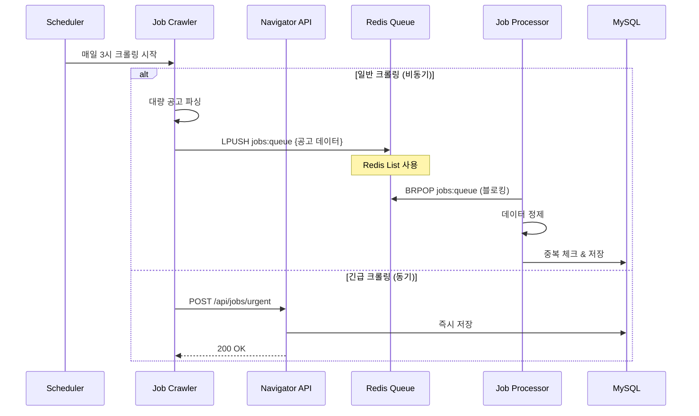

# Job Navigator 큐 기반 아키텍처 제안 (v1.5)

## 개요
v1에서 안정화 후 도입할 큐 기반 아키텍처 설계안입니다.

## 아키텍처 진화 로드맵

### Phase 1: MVP (현재 설계)
- 직접 API 호출
- 동기식 처리
- 빠른 구현과 검증

### Phase 2: 큐 도입 (v1.5)
- Redis Queue 활용 (이미 인프라 존재)
- 비동기 처리로 전환
- 점진적 마이그레이션

## 하이브리드 아키텍처 설계



## 큐 도입 시점 판단 기준

### 🚨 큐 도입이 필요한 신호:
1. **처리 시간 증가**
   - 전체 크롤링 시간 > 30분
   - API 타임아웃 발생

2. **데이터 볼륨 증가**
   - 일일 처리 공고 > 1,000건
   - 타겟 기업 > 20개

3. **안정성 이슈**
   - 크롤링 중 실패 시 전체 재시작 필요
   - 부분 실패 복구 어려움

## 점진적 마이그레이션 전략

### Step 1: 듀얼 모드 운영
```python
class CrawlerService:
    def __init__(self, use_queue=False):
        self.use_queue = use_queue
        
    async def submit_jobs(self, jobs):
        if self.use_queue:
            await self._submit_to_queue(jobs)
        else:
            await self._submit_to_api(jobs)
```

### Step 2: 특정 기업만 큐 사용
```yaml
companies:
  naver:
    use_queue: true  # 공고 많음
  kakao:
    use_queue: false # 공고 적음
```

### Step 3: 전체 전환
- 모든 크롤링을 큐 기반으로 전환
- API는 수동 트리거용으로만 유지

## Redis Queue 구현 상세

### 큐 구조
```
jobs:queue          # 처리 대기 큐
jobs:processing     # 처리 중 큐 (안정성)
jobs:failed         # 실패 큐 (재시도)
jobs:stats          # 통계 정보
```

### 메시지 포맷
```json
{
  "id": "uuid",
  "company": "naver",
  "job": {
    "title": "백엔드 개발자",
    "url": "https://...",
    "data": {...}
  },
  "timestamp": "2024-01-01T03:00:00Z",
  "retry_count": 0
}
```

### 안정성 보장
```python
# Reliable Queue Pattern
async def process_job():
    # 1. 원자적으로 큐에서 이동
    job = await redis.brpoplpush('jobs:queue', 'jobs:processing', timeout=10)
    
    try:
        # 2. 처리
        await save_to_database(job)
        
        # 3. 처리 완료 시 제거
        await redis.lrem('jobs:processing', 1, job)
        
    except Exception as e:
        # 4. 실패 시 재시도 큐로
        await redis.lpush('jobs:failed', job)
```

## 모니터링 및 관찰성

### Redis 큐 메트릭
```python
# 큐 상태 모니터링
queue_length = await redis.llen('jobs:queue')
processing_count = await redis.llen('jobs:processing')
failed_count = await redis.llen('jobs:failed')

# Prometheus 메트릭
job_queue_length.set(queue_length)
job_processing_count.set(processing_count)
job_failed_count.set(failed_count)
```

### 대시보드 (Grafana)
- 큐 길이 추이
- 처리 속도 (jobs/min)
- 실패율
- 평균 처리 시간

## 장점과 단점 정리

### 큐 기반 아키텍처 장점
1. **확장성**: 워커 수평 확장 가능
2. **복원력**: 부분 실패 시 재시도
3. **유연성**: 우선순위 큐, 지연 처리
4. **모니터링**: 실시간 처리 현황 파악

### 단점 및 복잡도
1. **디버깅 복잡도 증가**
2. **추가 인프라 관리**
3. **메시지 중복/손실 가능성**
4. **일관성 보장 어려움**

## 결론

### v1 (MVP)
- **현재 설계 유지** (직접 API 호출)
- 빠른 출시와 검증에 집중
- 실제 운영 데이터 수집

### v1.5 (성장기)
- 운영 데이터 기반 판단
- 필요시 점진적 큐 도입
- 하이브리드 운영으로 리스크 최소화

### v2 (성숙기)
- 전체 큐 기반 전환
- 이벤트 드리븐 아키텍처
- Kafka 도입 검토

---

"Premature optimization is the root of all evil" - Donald Knuth

MVP에서는 단순하게 시작하고, 실제 필요가 검증되면 복잡도를 추가하는 것이 현명합니다.